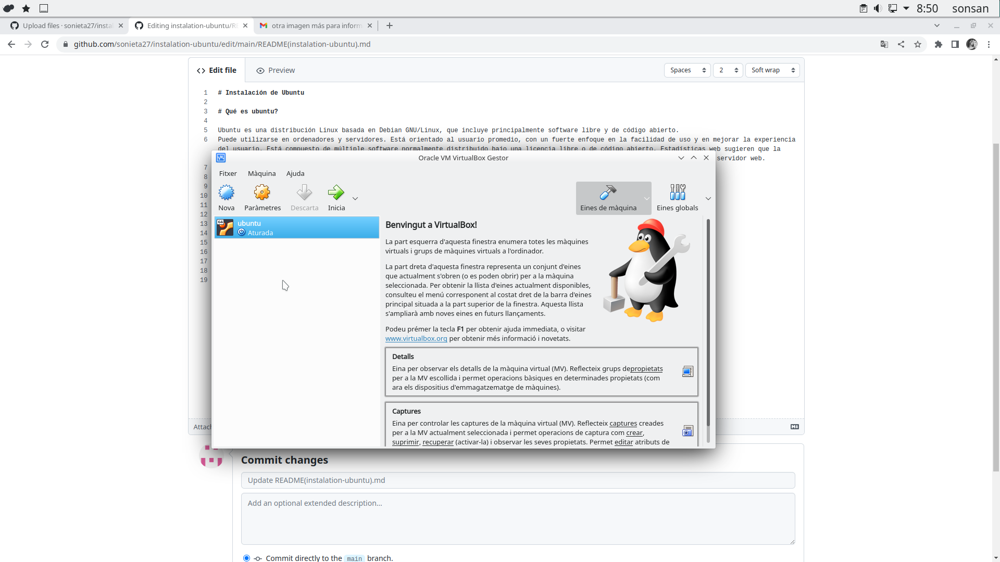
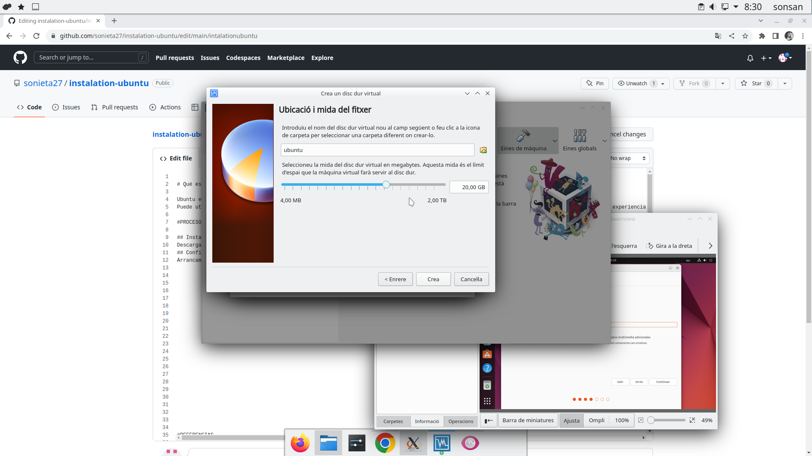

# Instalación de Ubuntu

# Qué es ubuntu?

Ubuntu es una distribución Linux basada en Debian GNU/Linux, que incluye principalmente software libre y de código abierto.
Puede utilizarse en ordenadores y servidores. Está orientado al usuario promedio, con un fuerte enfoque en la facilidad de uso y en mejorar la experiencia del usuario. Está compuesto de múltiple software normalmente distribuido bajo una licencia libre o de código abierto. Estadísticas web sugieren que la cuota de mercado de Ubuntu dentro de las distribuciones Linux es, aproximadamente, del 52 %,3​4​ y con una tendencia a aumentar como servidor web.

# PROCESO DE INSTALACIÓN

## Instalación de Virtualbox
Descargaremos [Virtualbox](https://www.virtualbox.org/) para el sistema operativo de nuestro ordenador.

## Configuración Virtualbox
Arrancamos Virtualbox y hacemos click en "Nueva": 

A continuaicón escribimos el nombre de la máquina virtual, en nuestro caso "Ubuntu". Vemos que se selecciona automáticamente el tipo de sistema a "Linux" y la versión "Ubuntu 64-bit".

Configuramos el tamaño de memoria para máquina virtual. Para Ubuntu 22.04 se recomiendan 4GB (4096MB):

Creamos un disco duro virtual, que se creará como un archivo, y que tendrá un tamaño de 25GB:

Nos descargamos previamente el archivo ISO de la distribución Linux que queramos. En nuestro caso hemos elegido la distribución [Ubuntu](https://ubuntu.com/), en su versión 22.04.

El siguiente paso es "montar" la ISO en el lector virtual de la máquinavirtual. Para ello hacemos click en "Configurar" y posteriormente vamos a la sección de "Almacenamiento":

Hacemos click en "Vacío" dentro del árbol "Controlador IDE", y posteriormente elegimos el archivo ISO desde el icono de "Unidad óptica":

Y por último en el apartado de pantalla (sin tener ubuntu ejecutado) aumentamos la memoria de video al máximo:

Entonces, ejecutamos.

## Instalación de Ubuntu
vemos la pantalla de Grub y elegimos la opción "Try or Install Ubuntu", y le damos a la tecla "Enter":

ELegimos el idioma y hacemos click en "Instalar Ubuntu":)

Elegimos la distribución del teclado:

Elegimos el tipo de instalación y si actualizaremos o instalaremos software de terceros:

Elegimos borrar todo el disco y que se instale Ubuntu como único sistema operativo:

Ponemos de dónde somos:

Ponemos nuestro nombre, nombre de usuario, contraseña y el nombre del equipo:

Así se ve la instalación de Ubuntu:

Así cuando esta termina:

Así se ve la prueba de Ubuntu:

# Referencias 
- "Ubuntu" Wikipedia. DIsponible en: [https://es.wikipedia.org/wiki/Ubuntu](https://es.wikipedia.org/wiki/Ubuntu) (Accedido: 10 de marzo, 2023)
